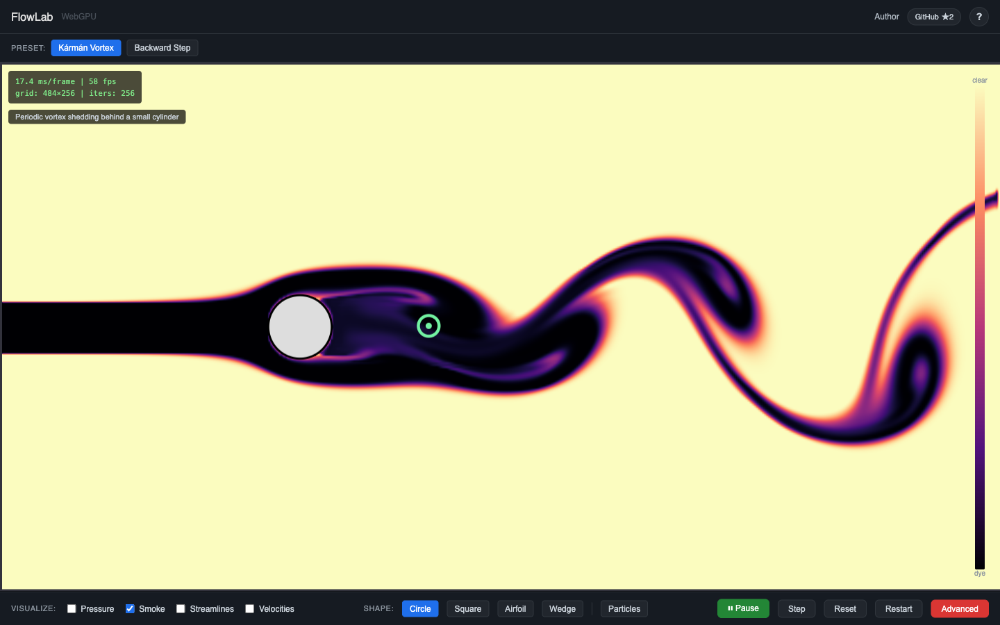
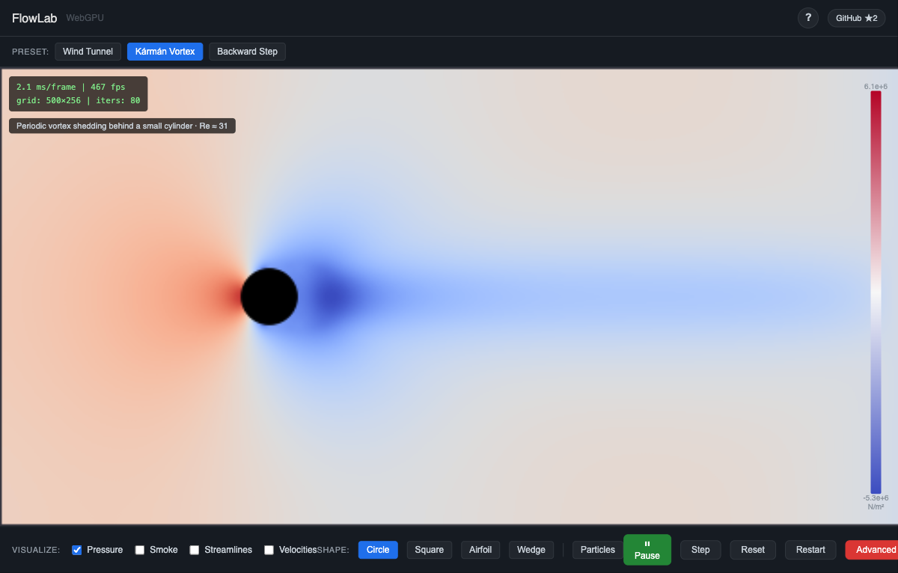

<div align="center">

# 🌀 FlowLab

**Real-time fluid dynamics in your browser, powered by WebGPU**

Drag obstacles through the flow. Watch a vortex street form — and die when you drop the Reynolds number below the onset the solver measures for itself. Explore pressure fields, streamlines, and smoke visualization, all running on the GPU.

[](https://www.w3.org/TR/webgpu/)
[](https://fastapi.tiangolo.com/)
[](LICENSE)

</div>





## Features

- **GPU-accelerated solver** — Red-Black Gauss-Seidel pressure projection + MacCormack advection (second-order, min/max limited), all in WGSL compute shaders
- **Real viscosity** — an explicit diffusion pass with automatic substepping, so the Reynolds control sets a physical parameter rather than a label
- **Measured, not asserted** — the Reynolds slider shows a badge when the requested Re leaves the range this grid can honestly deliver, and the Strouhal number is recovered live from the wake instead of quoted from a textbook
- **Interactive obstacles** — Drag circles, squares, airfoils, or wedges through the fluid with velocity coupling
- **Multiple visualizations** — Smoke dye (magma colormap), pressure field (coolwarm), streamlines, velocity arrows, tracer particles
- **Curated presets** — Karman vortex street, backward-facing step
- **Advanced controls** — Adjust timestep, relaxation, iterations, inflow velocity, Reynolds number, grid resolution
- **Adaptive resolution** — Auto-scales the grid between 64 and 512 based on measured frame time; 1024 is selectable manually

## Quick Start

**With Docker** (no Python installation required):

```bash
git clone https://github.com/palsagar/webgpu-fluid-solver.git
cd webgpu-fluid-solver
docker build -t flowlab .
docker run -p 8000:8000 flowlab
```

**With Python**:

```bash
git clone https://github.com/palsagar/webgpu-fluid-solver.git
cd webgpu-fluid-solver
uv run uvicorn server:app --port 8000
```

Open `http://localhost:8000` in Chrome 113+ (WebGPU required).

## How It Works

The solver implements a staggered MAC grid with:

1. **Pressure projection** — Red-Black Gauss-Seidel with SOR enforces incompressibility
2. **Boundary extrapolation** — copies interior velocities to boundary cells
3. **MacCormack advection** — a semi-Lagrangian backtrace, a reversed retrace, and a min/max-limited combine that cancels most of the backtrace's numerical diffusion
4. **Explicit viscous diffusion** — a five-point Laplacian, substepped so the stability limit is never violated

These run as WebGPU compute shaders dispatched into a single command buffer — `2 × numIters + 8 + N` per frame, which is 522 at the Kármán preset's 256 pressure iterations. The field view is then drawn by a WebGPU render pass straight from the simulation buffers — data stays on the GPU. The CPU reads back only what the overlays and the Strouhal probe need.

**On the numbers this app shows.** The advection scheme contributes an unrequested numerical viscosity on top of whatever you ask for. Rather than hand-wave it, it is measured — by fitting the decay of a Taylor–Green vortex with physical viscosity switched off — and that measurement is what bounds the Reynolds range the UI is willing to claim. At the startup resolution the honest window is Re 4.1 … 154; outside it, a badge says which bound you crossed and why, rather than the slider silently clamping. The Kármán preset sheds above a measured onset of **Re 52.2 ± 0.3** at a measured **St 0.166 … 0.200** across Re 55 … 140. Full derivations, and an explicit list of what has *not* been measured, are in [ADR-0008](docs/adr/0008-viscous-substepping-and-resolution-aware-window.md).

## Project Structure

```
server.py                  # FastAPI server (~40 lines)
static/
  index.html               # UI shell
  css/style.css             # Dark theme
  js/
    main.js                 # Entry point, animation loop
    fluid-solver.js         # GPU buffer management, compute dispatch
    field-renderer.js       # WebGPU render pass for the field view
    renderer.js             # Overlay canvas, GPU readbacks, colorbar
    interaction.js           # Mouse/touch drag, shape rasterization
    particles.js             # CPU Lagrangian tracer particles + emitters
    presets.js               # Preset configurations
    diagnostics.js           # Measured constants, honest-window logic, Strouhal detector
    ui.js                    # DOM bindings, sliders, keyboard shortcuts
    adaptive.js              # Frame-time-based resolution scaling
  shaders/
    pressure.wgsl            # Red-Black Gauss-Seidel pressure solver
    boundary.wgsl            # Boundary extrapolation
    advect.wgsl              # Semi-Lagrangian trace for velocity (both directions)
    advect_smoke.wgsl        # Semi-Lagrangian trace for smoke (both directions)
    maccormack_velocity.wgsl # Limited MacCormack combine for velocity
    maccormack.wgsl          # Limited MacCormack combine for smoke
    diffuse.wgsl             # Explicit five-point viscous diffusion
    render_field.wgsl        # Field view: bilinear sampling, colormap LUT, solids
  colormaps/
    viridis.png              # Scientific colormaps (256x1 LUT textures)
    coolwarm.png
    magma.png
```

## Browser Requirements

WebGPU support required: Chrome 113+, Edge 113+, or Firefox Nightly with `dom.webgpu.enabled` flag.

## Keyboard Shortcuts

| Key | Action |
|-----|--------|
| `P` | Play / Pause |
| `M` | Step one frame |
| `1-2` | Load preset |

## Documentation

For detailed technical documentation, see the **[Documentation Hub](docs/README.md)** — covering system architecture, numerical methods, and the GPU compute pipeline.

## Contributing

Feature requests, bug reports, and pull requests are welcome. Open an [issue](https://github.com/palsagar/webgpu-fluid-solver/issues) to suggest a new preset, visualization mode, or interaction feature, or submit a PR directly.

## Background

During my early PhD days (~2018) I wrote a 2D incompressible Navier-Stokes solver in Fortran 90 + CUDA — roughly 7k lines of code that sat on a dusty hard drive for years. The core numerics are standard CFD: staggered MAC grid, Gauss-Seidel pressure solve, semi-Lagrangian advection with operator splitting.

In 2026 I decided to see how far [Claude Code](https://claude.ai) (Anthropic's Opus 4.6) could take it. First pass: port the whole thing from Fortran 90 / CUDA V8 to modern C++20 / CUDA 12. The result was surprisingly solid — it handled the staggered grid data structures, pressure projection, and CUDA kernel modernization with minimal hand-holding.

That went well enough that I wanted to push further: remap the entire compute and rendering pipeline from C++/CUDA onto WebGPU, so the solver runs entirely in the browser using the client-side GPU for all the heavy lifting. No server-side compute, no WASM — just vanilla JS orchestrating WGSL compute shaders. What made it fun was figuring out the WebGPU-specific patterns — explicit bind group layouts (auto-layout silently drops unused bindings), ping-pong buffer management, and getting velocity readback performant enough for CPU-side particle tracing.

The key insight was that WebGPU's compute shader model maps naturally onto the same data-parallel patterns — workgroup dispatches over a uniform grid, storage buffer ping-pong for advection, red-black coloring for the pressure solve — that made the CUDA implementation effective. What changes is not the mathematics but the deployment model: instead of batch runs on a cluster, the simulation runs interactively on commodity hardware — measured at 120 fps at the coarse tiers and 69 fps at the shipped 256×256 with 256 pressure iterations — with the user as an active participant — dragging obstacles, injecting tracer particles, and observing flow phenomena like vortex shedding and recirculation in real time.
