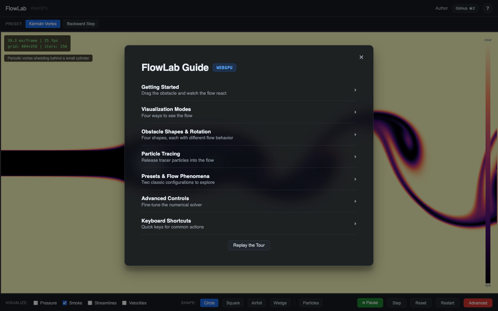

<div align="center">

# 🌀 FlowLab

**Real-time 2D incompressible flow — 100% GPU via WebGPU compute, in your browser.**

</div>


## Run it

```bash
uv run uvicorn server:app --reload --port 8000
```

Open http://localhost:8000 in Chrome (WebGPU required).

## Using FlowLab

- **Kármán Vortex** (default) — cylinder in a wind tunnel, vortex street live.
- **Backward Step** — no obstacle until you click the canvas to insert one.
- First visit opens a 12-step onboarding tour; replay it anytime via **Replay the Tour** in the guide.
- The **`?`** button opens the in-app guide — the full user manual.



| Key | Action |
|-----|--------|
| `P` | Play / pause |
| `M` | Step one frame |
| `1-2` | Load preset |

Drag the obstacle through the flow; Shift+mousemove rotates it. Sliders set Re, inflow velocity, and iterations; resolution switches in discrete tiers (64–1024).

## Understanding & hacking FlowLab

- [docs/architecture.md](docs/architecture.md) — system + module map
- [docs/gpu-pipeline.md](docs/gpu-pipeline.md) — WGSL pipelines, buffers, bind groups
- [docs/numerical-methods.md](docs/numerical-methods.md) — solver math + measured numbers
- [docs/adr/README.md](docs/adr/README.md) — 11 design decisions
- [docs/ROADMAP.md](docs/ROADMAP.md) — where it's going
- [CONTEXT.md](CONTEXT.md) — project vocabulary
- [docs/README.md](docs/README.md) — full annotated index

## Numbers

Measured, not asserted — derivations in [docs/numerical-methods.md](docs/numerical-methods.md):

- Honest Reynolds window **Re 4.1 … 154** (startup tier 256²; every tier re-measured)
- Vortex-shedding onset **Re 52.2**
- Strouhal **St 0.166 … 0.200**, recovered live from the wake
- **526 GPU dispatches/frame** at 256² (256 pressure iterations, default Re, incl. gauge normalization)
- Resolution tiers **64–1024** (1024 manual-only)

## Develop

- `npx playwright test` — 104/104 Playwright; headed, port 8321, `--enable-unsafe-webgpu` (all config defaults)
- No build step — vanilla ES modules
- `Dockerfile` for deploy
