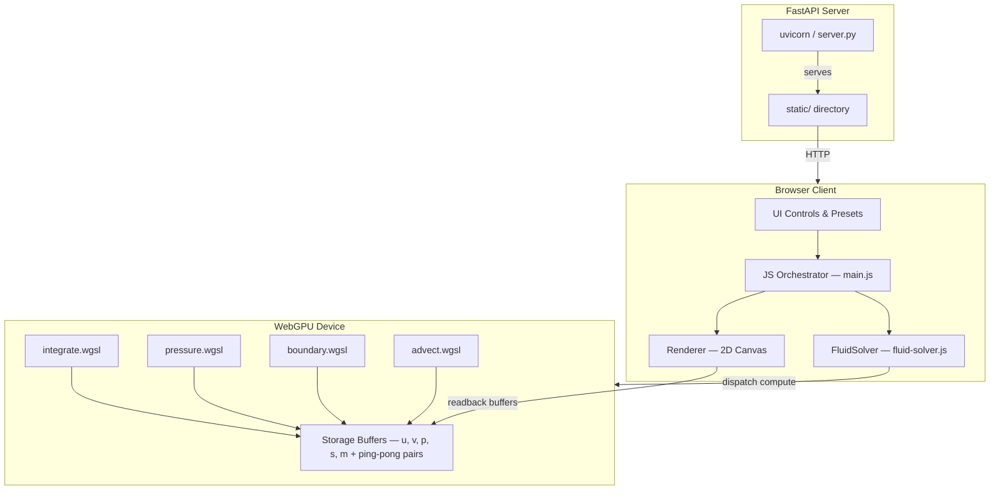

# WebGPU Eulerian Fluid Solver

Real-time 2D incompressible flow simulation running entirely on the GPU via WebGPU compute shaders. The solver uses an Eulerian (grid-based) approach with a MAC staggered grid, iterative pressure projection, and semi-Lagrangian advection. A 2D canvas renders the output using colormap visualization, streamlines, and velocity arrows. A minimal FastAPI backend serves the static files.

## System Overview



## Documentation

| Document | Description |
|----------|-------------|
| [System Architecture](architecture.md) | Tech stack, module graph, frame loop, presets |
| [Numerical Methods](numerical-methods.md) | Governing equations, MAC grid, pressure solver, advection |
| [GPU Pipeline](gpu-pipeline.md) | Buffer layout, compute dispatch, bind groups, rendering |

## Quick Start

```bash
uv run uvicorn server:app --port 8000
```

Open `http://localhost:8000` in Chrome 113+ (WebGPU required).
