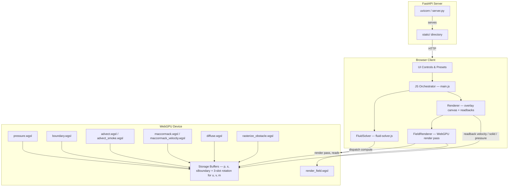

# 🌀 FlowLab — Technical Documentation

Real-time 2D incompressible flow simulation running entirely on the GPU via WebGPU compute shaders. The solver uses an Eulerian (grid-based) approach with a MAC staggered grid, iterative pressure projection, MacCormack advection (second-order, min/max limited), and an explicit viscous diffusion pass with automatic substepping. Rendering is hybrid: a WebGPU render pass draws the colormapped field straight from the simulation buffers, and a transparent 2D canvas above it carries the overlays — streamlines, velocity arrows, tracer particles, and the obstacle outline.

Every user-visible number is measured. The Reynolds control drives a real viscosity and a badge names the bound when the requested Re leaves the range this grid and pressure solve can deliver; the Strouhal readout is recovered from the solver's own wake. The measurements behind both, and their limitations, are in [ADR-0008](adr/0008-viscous-substepping-and-resolution-aware-window.md).

## System Overview


```mermaid
graph TD
    subgraph Server["FastAPI Server"]
        S1[uvicorn / server.py]
        S2[static/ directory]
        S1 -->|serves| S2
    end

    subgraph Browser["Browser Client"]
        UI[UI Controls & Presets]
        Orch[JS Orchestrator — main.js]
        Sim[FluidSolver — fluid-solver.js]
        Ren[Renderer — overlay canvas + readbacks]
        FRen[FieldRenderer — WebGPU render pass]
        UI --> Orch
        Orch --> Sim
        Orch --> Ren
        Ren --> FRen
    end

    subgraph GPU["WebGPU Device"]
        B["Storage Buffers — p, s, sBoundary + 3-slot rotation for u, v, m"]
        C2[pressure.wgsl]
        C3[boundary.wgsl]
        C4["advect.wgsl / advect_smoke.wgsl"]
        C6["maccormack.wgsl / maccormack_velocity.wgsl"]
        C7[diffuse.wgsl]
        C8[rasterize_obstacle.wgsl]
        C5[render_field.wgsl]
        C2 --> B
        C3 --> B
        C4 --> B
        C6 --> B
        C7 --> B
        C8 --> B
    end

    S2 -->|HTTP| Browser
    Sim -->|dispatch compute| GPU
    FRen -->|render pass, reads| B
    FRen --> C5
    Ren -->|readback velocity / solid / pressure| B
```

## Documentation

| Document | Description |
|----------|-------------|
| [System Architecture](architecture.md) | Tech stack, module graph, frame loop, presets, adaptive resolution, particle tracer |
| [Numerical Methods](numerical-methods.md) | Governing equations, MAC grid, pressure solver, MacCormack advection, explicit diffusion, measured numerical viscosity, Strouhal measurement |
| [GPU Pipeline](gpu-pipeline.md) | Buffer layout, the three-slot rotation, compute dispatch, bind groups and the storage budget, rendering |
| [Roadmap](ROADMAP.md) | Shipped milestones, planned features (Blow/Draw modes, Confinement), and known gaps |
| [Decision Records](adr/README.md) | Index of ADRs — what was decided, and what has actually shipped |

## Quick Start

```bash
uv run uvicorn server:app --port 8000
```

Open `http://localhost:8000` in Chrome 113+ (WebGPU required).
