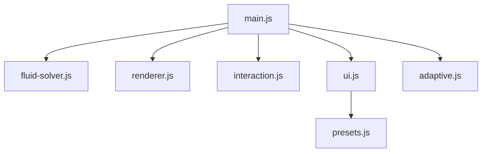
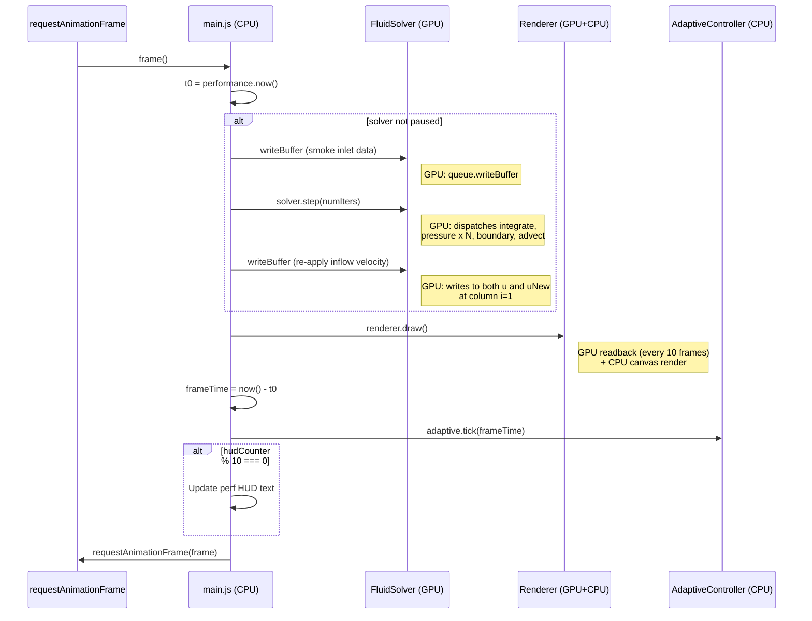
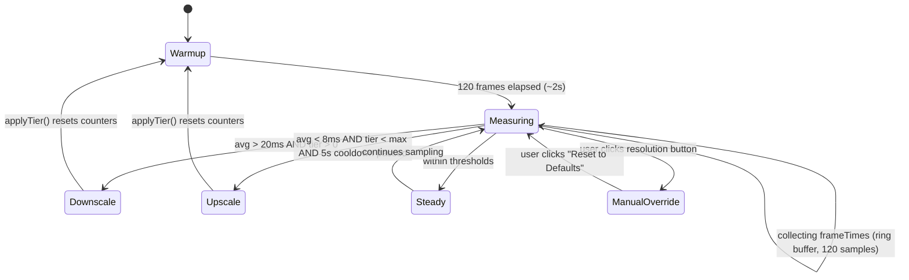

# System Architecture

Overview of the WebGPU Eulerian fluid solver: how the pieces fit together, the frame loop, preset system, adaptive resolution, and interaction model.

## 1. Tech Stack

| Layer | Technology | Notes |
|-------|-----------|-------|
| **Backend** | FastAPI + Uvicorn | ~10 lines of Python; serves static files only, plus a `/api/health` endpoint |
| **Frontend** | Vanilla ES modules | No build step, no bundler, no framework |
| **Compute** | WebGPU compute shaders (WGSL) | 4 shaders: integrate, pressure, boundary, advect |
| **Rendering** | 2D canvas (`putImageData` + Canvas 2D API) | Field visualization via `putImageData`; overlays (streamlines, arrows, obstacles) via canvas drawing calls. Not Three.js. |
| **Colormaps** | 256x1 PNG LUT textures | Scientific colormaps (magma, coolwarm, viridis) loaded from `static/colormaps/` |

## 2. Module Dependency Graph

Seven JS modules under `static/js/`. Arrows show `import` edges.

**Runtime wiring (not static imports):** `main.js` passes `solver`, `renderer`, `interaction`, and `ui` instances into `AdaptiveController` via its constructor. `UI` also receives a reference to `AdaptiveController` (`ui.adaptive = adaptive`). `Interaction` receives a back-reference to `Renderer` at runtime (`interaction._renderer = renderer`).

`FluidSolver`, `Renderer`, `Interaction`, `Presets`, and `AdaptiveController` are leaf modules with no static imports of their own.

## 3. Frame Loop

One iteration of `requestAnimationFrame(frame)` in `main.js`:

> See [GPU Pipeline](gpu-pipeline.md) for details on `solver.step()` and `renderer.draw()`.

## 4. Preset System

Defined in `static/js/presets.js`. The `PRESETS` object holds configuration and `loadPreset()` applies it.

### `loadPreset(name, solver, interaction)`

1. **Set solver params** -- `dt`, `gravity`, `omega`, `density` from the preset.
2. **Reset all fields** -- velocity (u, v), pressure, and smoke are zeroed / set to defaults (`m = 1.0` everywhere = clear).
3. **Build solid mask and inflow** -- iterates the grid to set boundary cells (`s = 0` for walls) and inflow velocity at column `i = 1`, based on `boundaryType`.
4. **Write to both ping-pong buffers** -- calls `solver.resetFlipState()`, then writes `u`, `uNew`, `v`, `vNew`, `m`, `mNew` so neither stale buffer survives.
5. **Resize interaction arrays** if the grid size changed; stores the boundary mask for later obstacle rasterization.
6. **Rasterize obstacle** if the preset defines one (via `interaction.rasterizeObstacle()`).
7. **Return** `{ show, numIters, smokeInletData, boundaryVelData }` -- the caller (`UI`) stores these and uses them each frame.

### Working Presets

| Preset | `numIters` | `dt` | `inVel` | `omega` | Obstacle | Boundary Type |
|--------|-----------|------|---------|---------|----------|---------------|
| **Wind Tunnel** | 40 | 1/60 | 2.0 | 1.9 | Circle, r=0.15 at (0.4, 0.5) | `windTunnel` |
| **Karman Vortex** | 80 | 1/120 | 1.0 | 1.9 | Circle, r=0.06 at (0.3, 0.5) | `windTunnel` |
| **Backward Step** | 60 | 1/60 | 1.5 | 1.9 | None | `backwardStep` (step block x<0.3, y<0.5) |

All presets use `gravity = 0` and `density = 1000`. Smoke inlet is a narrow central band of dark dye (`m = 0`) at the left edge.

## 5. Adaptive Resolution

Defined in `static/js/adaptive.js`. Disabled by default; can be enabled programmatically.

### Resolution Tiers

| Index | numY | Default? |
|-------|------|----------|
| 0 | 64 | |
| 1 | 128 | |
| 2 | 256 | Yes |
| 3 | 512 | |

`numX` is computed from the container's aspect ratio: `Math.round(tier * width / height)`.

### `applyTier()` Sequence

1. `solver.resize(numX, numY, h)` -- reallocates GPU buffers
2. `ui.reapplyCurrentPreset()` -- re-runs `loadPreset` with the current preset name
3. `renderer.resize(numX, numY, h)` -- resizes canvas and rendering state
4. Resets `frameTimes` and `warmupFrames` so measurement restarts clean

### Manual Override

When the user clicks a resolution button, `manualOverride` is set to `true` and `tick()` returns immediately (no auto-scaling). Clicking "Reset to Defaults" clears the override flag and reapplies the current preset.

## 6. Interaction Model

Defined in `static/js/interaction.js`. Handles mouse/touch drag to place and move obstacles.

### Coordinate Conversion

`screenToSim(clientX, clientY)` maps pixel coordinates to simulation domain coordinates:
- `x = (mouseX / canvasWidth) * numX * h`
- `y = (1 - mouseY / canvasHeight) * numY * h` (y-axis is flipped: canvas top = simulation top)

### Obstacle Rasterization

`rasterizeObstacle(centerX, centerY, vx, vy)` follows three steps:

1. **Restore old bounding box** -- cells from the previous obstacle position are reset to their boundary mask values. Former obstacle cells get their smoke cleared to `m = 1.0` (written to both `m` and `mNew`). Pressure is zeroed for the old columns.
2. **Rasterize new shape** -- iterates cells within the new bounding box, applies the shape test, and marks hits as solid (`s = 0`) with the drag velocity (`vx`, `vy`). Velocity is written to both `u[i]` and `u[i+1]` for proper staggered-grid coupling.
3. **Save bounding box** -- stores `{iMin, iMax, jMin, jMax}` for the next call.

After rasterization, the solid mask and velocity fields are written to the GPU (both ping-pong buffers), and `renderer.invalidateSolid()` is called.

### Shape Tests

| Shape | Test |
|-------|------|
| **Circle** | `dx^2 + dy^2 < r^2` |
| **Square** | `|dx| < r` and `|dy| < r` |
| **Airfoil** | NACA 0012 thickness profile; chord = `4r`, checks `|dy| < y_t(x/chord)` |
| **Wedge** | Half-angle = 15 degrees; length = `3r`, checks `|dy| < x * tan(15deg)` |

`dx` and `dy` are cell-center offsets from the obstacle center.

### Velocity Coupling

During drag, velocity is computed as `(currentPos - prevPos) / dt` and passed to `rasterizeObstacle`. All cells inside the obstacle (and `u` at `i+1`) receive this velocity, coupling the obstacle motion to the fluid.

### Smoke Clearing

When an obstacle moves away from cells it previously occupied, those cells have their smoke reset to `m = 1.0` (clear), preventing stale dye imprints from lingering in the flow field.
