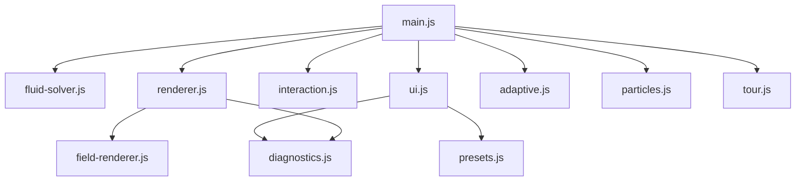

# System Architecture

How the WebGPU Eulerian fluid solver fits together: frame loop, presets, adaptive resolution, and interaction model.

Hub: [../README.md](../README.md) · Index: [README.md](README.md) · Related: [GPU Pipeline](gpu-pipeline.md) · [Numerical Methods](numerical-methods.md) · [ADR index](adr/README.md)

## 1. Tech Stack

| Layer | Technology | Notes |
|-------|-----------|-------|
| **Backend** | FastAPI + Uvicorn | ~40 lines; static files + `/api/health` |
| **Frontend** | Vanilla ES modules | No build step |
| **Compute** | WebGPU WGSL | 8 shader files, 14 compute pipelines; canonical dispatch count is `2·numIters + 12 + N` (526 at Kármán defaults: 256 iterations, N=2). See [GPU Pipeline](gpu-pipeline.md). |
| **Rendering** | WebGPU render pass + 2D canvas overlays | Field: fullscreen triangle, bilinear sampling, colormap LUT, in-shader solids. Overlays: transparent Canvas 2D. See ADR-0005. |
| **Colormaps** | 256x1 PNG LUT textures | magma, coolwarm in `static/colormaps/` |

## 2. Module Dependency Graph

Eleven JS modules under `static/js/`:

```mermaid
graph TD
    main["main.js"] --> FluidSolver["fluid-solver.js"]
    main --> Renderer["renderer.js"]
    main --> Interaction["interaction.js"]
    main --> UI["ui.js"]
    main --> Adaptive["adaptive.js"]
    main --> Particles["particles.js"]
    main --> Tour["tour.js"]
    UI --> Presets["presets.js"]
    UI --> Diagnostics["diagnostics.js"]
    Renderer --> FieldRenderer["field-renderer.js"]
    Renderer --> Diagnostics
```

**`tour.js`** — onboarding module: welcome modal + 12-step spotlight tour. Exposed on `window.__flowlab` (`main.js:104`) for Playwright. Uses a four-rect spotlight hole, `localStorage` flag `flowlab.tour.v1`, z-index 300–302, click-only writes, reduced-motion handling.

**`diagnostics.js`** — pure numeric functions: viscosity constants, `honestWindow()` / `windowState()`, `probeCell()`, `StrouhalProbe`. No DOM/GPU/solver, so every constant is testable headless.

**Runtime wiring:** `main.js` passes `solver`, `renderer`, `interaction`, `ui` into `AdaptiveController`; `UI` gets `ui.adaptive`; `Interaction` gets `interaction._renderer`; `ParticleSystem` is handed to `Renderer` and `Interaction` but holds no reference back. `FluidSolver`, `Interaction`, `Presets`, `ParticleSystem`, `AdaptiveController`, `FieldRenderer`, and `Tour` are leaves.

## 3. Frame Loop

One `requestAnimationFrame(frame)` iteration in `main.js`:

1. If not paused: `writeBuffer(smoke inlet)`, `solver.step(numIters)`, `writeBuffer(re-apply inflow at i=1)`.
2. `renderer.draw()` — field render pass + overlay canvas + throttled readbacks.
3. `ui.tick()` — update Strouhal readout.
4. `frameTime = ts - lastFrameTs`; `adaptive.tick(frameTime)`.
5. Every 10 frames: update perf HUD text.
6. `requestAnimationFrame(frame)`.

`writeBuffer` calls use `device.queue.writeBuffer`. `solver.step()` submits pressure red/black × numIters, pressure-reference normalization (4 passes), boundary H/V, MacCormack velocity ×3, MacCormack smoke ×3, and diffuse × N in one command buffer — `2·numIters + 12 + N` dispatches per step. The inflow re-application writes all three velocity slots at column `i=1`.

Frame time is the rAF timestamp delta. The old `performance.now()` bracket reported CPU encode time, wrong by up to ~640×. A `visibilitychange` handler drops one sample on tab resume so the controller does not ingest a multi-second frame.

See [GPU Pipeline](gpu-pipeline.md) for shader/dispatch details.

## 4. Preset System

Defined in `static/js/presets.js`. `loadPreset(name, solver, interaction)`:

1. Set solver params (`dt`, `omega`, `density`).
2. Reset fields — zero velocity/pressure; `m = 1.0` smoke clear.
3. Build solid mask and inflow — set boundary cells (`s = 0`) and inflow velocity at `i = 1` by `boundaryType`.
4. Write all fields to every rotation slot — `resetFlipState()`, then `writeSolidMask` / `writeVelocityU` / `writeVelocityV` / `writeSmoke` (velocity/smoke fan out to all three slots).
5. Upload boundary-mask buffer — `writeBoundaryMask(sData)` writes permanent walls to `sBoundary` once per preset load; obstacle not rasterized yet.
6. Rasterize obstacle if the preset defines one.
7. Return `{ show, numIters, smokeInletData, boundaryVelData }` for the per-frame loop.

### Working Presets

| Preset | `numIters` | `dt` | `inVel` | `omega` | Obstacle | Boundary Type |
|--------|-----------|------|---------|---------|----------|---------------|
| **Kármán Vortex** | 256 | 1/240 | 1.0 | 1.9 | Circle, r=0.06 at (0.3, 0.5) | `windTunnel` |
| **Backward Step** | 60 | 1/60 | 1.5 | 1.9 | None (insertable by first canvas click) | `backwardStep` (step block x<0.3, y<0.5) |

`density = 1000` for both. Smoke inlet is a narrow central dye band (`m = 0`) at the left edge. Inflow column is `i = 1`; no gravity.

**Only Kármán is calibrated.** The numerical-viscosity table in `diagnostics.js` was measured at `dt = 1/240`, 256 iterations, `U = 1.0` — the Kármán preset only. Backward Step uses different `dt`/`numIters`/`U`, so its Re badge reports **`unmeasured`**. See [Numerical Methods §9](numerical-methods.md#9-numerical-viscosity-measured).

### Backward Step insert-on-click

Backward Step ships with no obstacle. The first canvas pointerdown inserts the active shape at the click point and un-hides it: `interaction.showObstacle = true` (`interaction.js:163-166`). The overlay ring, shape buttons, and Re/St badges go live. This relaxes ADR-0011's rasterize guard on the mousedown path only; Shift+mousemove rotation still guards against mutating a hidden obstacle (`interaction.js:198`).

## 5. Adaptive Resolution

Defined in `static/js/adaptive.js`. Disabled by default. State machine: Warmup (~2s) → Measuring (120-sample ring) → Downscale if avg > 20 ms and tier > 0, Upscale if avg < 12 ms and tier < maxAutoTier after 5s cooldown, or ManualOverride on user tier click. `applyTier()` returns to Warmup and resets counters.

### Resolution Tiers

| Index | numY | Default? | Auto? |
|-------|------|----------|-------|
| 0 | 64 | | Yes |
| 1 | 128 | | Yes |
| 2 | 256 | Yes | Yes |
| 3 | 512 | | Yes |
| 4 | 1024 | | No — manual only |

`numX = Math.round(tier * width / height)`. `maxAutoTierIndex` caps auto-promotion at 512; tier 1024 is too slow to auto-promote into. `downscale()` further lowers the cap for failed tiers.

### Measured frame times

| Tier | 64 | 128 | 256 | 512 | 1024 |
|---|---|---|---|---|---|
| Frame time (ms) | 8.33 | 8.34 | 17.75 | 62.01 | 257.36 |

`UPSCALE_MS = 12` sits between the two vsync-capped tiers (8.33 ms) and the first GPU-bound one (17.75 ms). It fits a 120 Hz frame budget; on 60 Hz vsync the interval is ~16.7 ms, so no tier can beat the threshold and upscale never auto-promotes. So the upscale logic is display-refresh dependent: it may auto-promote on a 120 Hz display, but on 60 Hz vsync no tier clears the 12 ms threshold and upscale never fires.

Window resizes do **not** re-tier: `applyTier()` destroys GPU buffers, reloads the preset, and clears emitters, so re-tiering on resize would silently discard user state. Only canvas backing stores resize.

### `applyTier()` Sequence

1. `solver.resize(numX, numY, h)` — reallocate GPU buffers.
2. `ui.reapplyCurrentPreset()` — re-run `loadPreset`.
3. `renderer.resize(numX, numY, h)` — recreate staging buffer, clear cached readbacks/overlay geometry, drop `FieldRenderer`'s stale bind groups. Canvas dimensions are not touched.
4. Reset `frameTimes` and warmup timer.

### Manual Override

Clicking a resolution button sets `manualOverride = true` and short-circuits `tick()`. "Reset to Defaults" clears the flag and reapplies the current preset.

## 6. Interaction Model

Defined in `static/js/interaction.js`. Handles mouse/touch drag for obstacles; a "Particles" mode switch makes clicks place emitters instead.

### Coordinate Conversion

`screenToSim(clientX, clientY)`: `x = mouseX/canvasWidth * numX*h`; `y = (1 - mouseY/canvasHeight) * numY*h` (y flipped).

### Pointerdown-insert behavior

In obstacle-less presets, the first pointerdown sets `showObstacle = true` and starts a drag/rasterize at the click point. Once shown, subsequent drags and rotations operate normally. Drag-end re-rasterizes at zero velocity only when `showObstacle` is true.

### Obstacle Rasterization

`rasterizeObstacle(centerX, centerY, vx, vy)` runs on the GPU. `interaction.js` packs center, velocity, shape, radius, angle, and previous bbox into a 64-byte uniform and calls `solver.rasterizeObstacle()`. The solver snapshots `s` into `sOld` via GPU `copyBufferToBuffer`, uploads the uniform, and dispatches `rasterize_obstacle.wgsl` once per rotation slot (three dispatches). Writes to `s` and `p` are idempotent across slots.

The shader does three steps in one pass:
1. **Restore old footprint** — non-boundary cells inside the previous bbox return to fluid (`s = 1.0`) with zero velocity/pressure. Boundary cells (`sBoundary == 0`) are never carved or restored.
2. **Rasterize new shape** — cells passing the shape test become solid (`s = 0.0`) and carry obstacle drag velocity on the cell-owned face and the face to the right.
3. **Clear smoke imprints** — cells solid in `sOld` but now fluid have smoke reset to `m = 1.0`. `sOld` prevents later dispatches from seeing an already-restored mask and skipping the clear.

After dispatches, `renderer.invalidateSolid()` is called. The drag also clears the Strouhal probe sample series.

### Shape Tests

| Shape | Test |
|-------|------|
| Circle | `dx² + dy² < r²` |
| Square | `|ldx| < r` and `|ldy| < r` |
| Airfoil | NACA 0012; chord = `4r`, `|ly| < y_t(lx/chord)` |
| Wedge | Half-angle 15°, length = `3r`, `|ly| < lx*tan(15°)` |

`dx`/`dy` are cell-center offsets; `ldx`/`ldy` inverse-rotate by `obstacleAngle`. Tests live in `static/shaders/rasterize_obstacle.wgsl`.

### Velocity Coupling

Drag velocity = `(currentPos - prevPos) / dt`, clamped to `[-MAX_DRAG_VELOCITY, MAX_DRAG_VELOCITY]` (max = 5.0). The shader writes it into solid cells and the face to their right. MacCormack advection preserves the moving-wall BC during the inviscid step; the viscous pass ghosts mask-buried faces to `w + (w - center)` with `w` the stored wall velocity, while index-buried faces (`i == 0` / `j == 0`) and top-row u-faces (`j == numY - 1`) still ghost to `-center` (ADR-0011).

### Smoke Clearing

Vacated cells reset smoke to `m = 1.0` only where the old solid mask was solid, preventing stale dye imprints.

## 7. Particle Tracer

Defined in `static/js/particles.js`. Lagrangian tracer particles advected on the CPU through velocity readbacks.

`ParticleSystem` API: `addEmitter(x, y)` (max 10); `step(uData, vData, dt, h, numX, numY, solidData)` spawns 3/emitter/frame, advects via bilinear MAC interpolation, and removes aged/out-of-domain/solid particles; `draw(ctx, numX, numY, h, scale)` renders trails/markers on the overlay canvas (`scale = renderer._overlayScale`); `clear()` removes everything.

A "Particles" toggle switches interaction mode to place emitters. Particles are visualization-only and capped at 5000 particles / 10 emitters / 20 trail positions. Cleared on preset change and grid resize.
