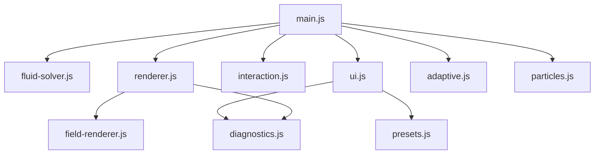
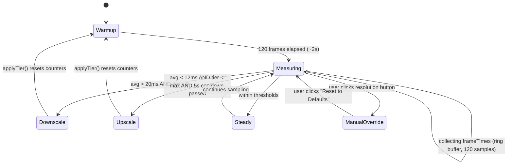

# System Architecture

Overview of the WebGPU Eulerian fluid solver: how the pieces fit together, the frame loop, preset system, adaptive resolution, and interaction model.

## 1. Tech Stack

| Layer | Technology | Notes |
|-------|-----------|-------|
| **Backend** | FastAPI + Uvicorn | ~10 lines of Python; serves static files only, plus a `/api/health` endpoint |
| **Frontend** | Vanilla ES modules | No build step, no bundler, no framework |
| **Compute** | WebGPU compute shaders (WGSL) | 7 shader files, 8 pipelines: pressure, boundary (two entry points), velocity advect, smoke advect, velocity combine, smoke combine, diffuse |
| **Rendering** | WebGPU render pass (field) + 2D canvas (overlays) | Field View: fullscreen triangle, bilinear buffer sampling, colormap LUT texture, in-shader solids. Overlays: transparent Canvas 2D layer on top. See ADR-0005. |
| **Colormaps** | 256x1 PNG LUT textures | Scientific colormaps (magma, coolwarm, viridis) loaded from `static/colormaps/` |

## 2. Module Dependency Graph

Ten JS modules under `static/js/`. Arrows show `import` edges.

```mermaid
graph TD
    main["main.js"] --> FluidSolver["fluid-solver.js"]
    main --> Renderer["renderer.js"]
    main --> Interaction["interaction.js"]
    main --> UI["ui.js"]
    main --> Adaptive["adaptive.js"]
    main --> Particles["particles.js"]
    UI --> Presets["presets.js"]
    UI --> Diagnostics["diagnostics.js"]
    Renderer --> FieldRenderer["field-renderer.js"]
    Renderer --> Diagnostics
```

**`diagnostics.js`** is the measurement module: the numerical-viscosity constants and their provenance, `honestWindow()` / `windowState()` for the Re badge, `probeCell()` for probe placement, and the `StrouhalProbe` detector. It is **pure functions over numbers** — no DOM, no GPU, no solver instance — which is what makes every constant in it testable without a browser and reviewable without reading the app. `ui.js` supplies the live `dt`, tier and `viscNuMax`; `renderer.js` uses only `probeCell()` to draw the marker.

**Runtime wiring (not static imports):** `main.js` passes `solver`, `renderer`, `interaction`, and `ui` instances into `AdaptiveController` via its constructor. `UI` also receives a reference to `AdaptiveController` (`ui.adaptive = adaptive`). `Interaction` receives a back-reference to `Renderer` at runtime (`interaction._renderer = renderer`). The `ParticleSystem` instance is handed *to* `Renderer` and `Interaction` (`renderer.particleSystem = particles`, `interaction._particleSystem = particles`); it holds no reference back — velocity, grid, and solid data arrive as `step()` arguments from `Renderer.draw()`.

`FluidSolver`, `Interaction`, `Presets`, `ParticleSystem`, `AdaptiveController`, and `FieldRenderer` are leaf modules with no static imports of their own. `Renderer` imports `FieldRenderer`.

## 3. Frame Loop

One iteration of `requestAnimationFrame(frame)` in `main.js`:

```mermaid
sequenceDiagram
    participant RAF as requestAnimationFrame
    participant Main as main.js (CPU)
    participant Solver as FluidSolver (GPU)
    participant Renderer as Renderer (GPU+CPU)
    participant Adaptive as AdaptiveController (CPU)

    participant UI as UI (CPU)

    RAF->>Main: frame(ts)

    alt solver not paused
        Main->>Solver: writeBuffer (smoke inlet data)
        Note right of Solver: GPU: queue.writeBuffer
        Main->>Solver: solver.step(numIters)
        Note right of Solver: GPU: pressure x 2N, boundary H/V,<br/>MacCormack velocity x3, MacCormack smoke x3,<br/>diffuse x N — one submit
        Main->>Solver: writeBuffer (re-apply inflow velocity)
        Note right of Solver: GPU: writes all three velocity slots<br/>at column i=1
    end

    Main->>Renderer: renderer.draw()
    Note right of Renderer: GPU render pass for the field (every frame)<br/>+ Canvas 2D overlays<br/>+ throttled readbacks (every 10 frames)

    Main->>UI: ui.tick()
    Note right of UI: samples the Strouhal probe in<br/>simulation time; updates #val-st

    Main->>Main: frameTime = ts - lastFrameTs
    Main->>Adaptive: adaptive.tick(frameTime)

    alt hudCounter % 10 === 0
        Main->>Main: Update perf HUD text
    end

    Main->>RAF: requestAnimationFrame(frame)
```

**Frame time is the rAF timestamp delta, not a `performance.now()` bracket.** It used to be the latter, wrapped around `step()` + `draw()` — both of which return before the GPU has done the work, so the HUD read CPU *encode* time and was wrong by 28x to 640x depending on tier (0.4 ms reported against 257 ms actual at tier 1024). The same bad signal was fed to `AdaptiveController`, whose `> 20 ms` downscale condition was consequently unreachable. A `visibilitychange` handler drops one sample rather than feeding the controller a multi-second "frame" when a hidden tab resumes.

> See [GPU Pipeline](gpu-pipeline.md) for details on `solver.step()` and `renderer.draw()`.

## 4. Preset System

Defined in `static/js/presets.js`. The `PRESETS` object holds configuration and `loadPreset()` applies it.

### `loadPreset(name, solver, interaction)`

1. **Set solver params** -- `dt`, `omega`, `density` from the preset.
2. **Reset all fields** -- velocity (u, v), pressure, and smoke are zeroed / set to defaults (`m = 1.0` everywhere = clear).
3. **Build solid mask and inflow** -- iterates the grid to set boundary cells (`s = 0` for walls) and inflow velocity at column `i = 1`, based on `boundaryType`.
4. **Write to every rotation slot** -- calls `solver.resetFlipState()`, then writes velocity and smoke through `writeU` / `writeV` / `writeSmoke`, which fan out to all three slots so no stale slot survives.
5. **Resize interaction arrays** if the grid size changed; stores the boundary mask for later obstacle rasterization.
6. **Rasterize obstacle** if the preset defines one (via `interaction.rasterizeObstacle()`).
7. **Return** `{ show, numIters, smokeInletData, boundaryVelData }` -- the caller (`UI`) stores these and uses them each frame.

### Working Presets

| Preset | `numIters` | `dt` | `inVel` | `omega` | Obstacle | Boundary Type |
|--------|-----------|------|---------|---------|----------|---------------|
| **Wind Tunnel** | 40 | 1/60 | 2.0 | 1.9 | Circle, r=0.15 at (0.4, 0.5) | `windTunnel` |
| **Karman Vortex** | 256 | 1/240 | 1.0 | 1.9 | Circle, r=0.06 at (0.3, 0.5) | `windTunnel` |
| **Backward Step** | 60 | 1/60 | 1.5 | 1.9 | None | `backwardStep` (step block x<0.3, y<0.5) |

All presets use `density = 1000`. Smoke inlet is a narrow central band of dark dye (`m = 0`) at the left edge.

**Only Kármán is calibrated.** The numerical-viscosity table in `diagnostics.js` was measured on one slice — `dt = 1/240`, 256 pressure iterations, `U = 1.0` — which is the Kármán preset and only the Kármán preset. Wind Tunnel and Backward Step run a different `dt`, a different iteration count and a different `U`, so the Re badge reports the ceiling there as **`unmeasured`** rather than carrying the table across. That is a visible product change (two of three presets open with a badge) and it is the honest state: the carry previously produced a physically impossible pair on Wind Tunnel — a projection ceiling of Re 771 against a converged scheme ceiling of Re 297, i.e. an under-converged solve dissipating *less* than a converged one. Measuring the table at each preset's own operating point is what would close it.

## 5. Adaptive Resolution

Defined in `static/js/adaptive.js`. Disabled by default; can be enabled programmatically.

```mermaid
stateDiagram-v2
    [*] --> Warmup
    Warmup --> Measuring : 120 frames elapsed (~2s)
    Measuring --> Measuring : collecting frameTimes (ring buffer, 120 samples)
    Measuring --> Downscale : avg > 20ms AND tier > 0
    Measuring --> Upscale : avg < 12ms AND tier < max AND 5s cooldown passed
    Measuring --> Steady : within thresholds
    Steady --> Measuring : continues sampling

    Downscale --> Warmup : applyTier() resets counters
    Upscale --> Warmup : applyTier() resets counters

    Measuring --> ManualOverride : user clicks resolution button
    ManualOverride --> Measuring : user clicks "Reset to Defaults"
```

### Resolution Tiers

| Index | numY | Default? | Auto-selectable? |
|-------|------|----------|------------------|
| 0 | 64 | | Yes |
| 1 | 128 | | Yes |
| 2 | 256 | Yes | Yes |
| 3 | 512 | | Yes |
| 4 | 1024 | | No — manual only |

`numX` is computed from the container's aspect ratio: `Math.round(tier * width / height)`.

`AdaptiveController.maxAutoTierIndex` caps automatic promotion at 512. At the Kármán
preset's 256 pressure iterations, tier 1024 measures **257 ms/frame (~3.9 fps)** on the
dev machine, so auto-promoting into it would stall for seconds, drop back, and
immediately promote again. `downscale()` lowers the cap further whenever a tier proves
too slow, so the controller never retries a tier it has already failed.

### Why the upscale threshold is 12 ms, and what that costs

Measured frame times per tier on the dev machine (120 Hz display, Kármán at 256
iterations): **8.33 / 8.34 / 17.75 / 62.01 / 257.36 ms** at tiers 64 … 1024.

`UPSCALE_MS = 12` sits between the two vsync-capped tiers (8.33 ms) and the first
GPU-bound one (17.75 ms), with ~40% margin either side. It replaced a threshold of 8 ms,
which was **structurally unreachable** once the controller was fed honest wall-clock
time: *no frame can beat vsync*, so a tier with headroom does not read "fast" — it reads
the display's refresh period. The old 8 ms only ever fired because it was being handed
0.4 ms of CPU encode time, and the result was that the controller promoted 256 → 512
within ~3 s and pinned there at 17 fps, unable to recover because the signal that would
trigger `downscale()` was the broken one.

**The honest cost: `UPSCALE_MS = 12` is calibrated on one machine and one display.** On a
60 Hz display no tier can beat 16.67 ms, so nothing auto-promotes at all. That is the
conservative direction and the manual tier buttons are unaffected, but it means the
controller's useful range is display-dependent in a way a single constant cannot express.
A refresh-relative threshold would be the principled version; it needs a robust vsync
estimate, which an observed minimum is not.

Window resizes do **not** re-tier: `applyTier()` destroys every GPU buffer, reloads the
preset, and clears particle emitters, so running it on a resize would silently discard
user state. Only the canvas backing stores are resized.

### `applyTier()` Sequence

1. `solver.resize(numX, numY, h)` -- reallocates GPU buffers
2. `ui.reapplyCurrentPreset()` -- re-runs `loadPreset` with the current preset name
3. `renderer.resize(numX, numY, h)` -- recreates the staging buffer, clears cached readbacks/overlay geometry, and drops `FieldRenderer`'s stale bind groups. Canvas dimensions are **not** touched: both canvases are display-resolution and independent of grid size.
4. Resets `frameTimes` and `warmupFrames` so measurement restarts clean

### Manual Override

When the user clicks a resolution button, `manualOverride` is set to `true` and `tick()` returns immediately (no auto-scaling). Clicking "Reset to Defaults" clears the override flag and reapplies the current preset.

## 6. Interaction Model

Defined in `static/js/interaction.js`. Handles mouse/touch drag to place and move obstacles.

### Coordinate Conversion

`screenToSim(clientX, clientY)` maps pixel coordinates to simulation domain coordinates:
- `x = (mouseX / canvasWidth) * numX * h`
- `y = (1 - mouseY / canvasHeight) * numY * h` (y-axis is flipped: canvas top = simulation top)

### Obstacle Rasterization

`rasterizeObstacle(centerX, centerY, vx, vy)` follows three steps:

1. **Restore old bounding box** -- cells from the previous obstacle position are reset to their boundary mask values. Former obstacle cells get their smoke cleared to `m = 1.0` (via `writeSmokeCell`, which writes all three slots). Pressure is zeroed for the old columns.
2. **Rasterize new shape** -- iterates cells within the new bounding box, applies the shape test, and marks hits as solid (`s = 0`) with the drag velocity (`vx`, `vy`). Velocity is written to both `u[i]` and `u[i+1]` for proper staggered-grid coupling.
3. **Save bounding box** -- stores `{iMin, iMax, jMin, jMax}` for the next call.

After rasterization, the solid mask and velocity fields are written to the GPU (every rotation slot), and `renderer.invalidateSolid()` is called. The drag also clears the Strouhal probe's sample series — a wake that has just had its obstacle moved is no longer the wake the accumulated samples describe.

### Shape Tests

| Shape | Test |
|-------|------|
| **Circle** | `dx^2 + dy^2 < r^2` |
| **Square** | `|dx| < r` and `|dy| < r` |
| **Airfoil** | NACA 0012 thickness profile; chord = `4r`, checks `|dy| < y_t(x/chord)` |
| **Wedge** | Half-angle = 15 degrees; length = `3r`, checks `|dy| < x * tan(15deg)` |

`dx` and `dy` are cell-center offsets from the obstacle center.

### Velocity Coupling

During drag, velocity is computed as `(currentPos - prevPos) / dt` and passed to `rasterizeObstacle`. All cells inside the obstacle (and `u` at `i+1`) receive this velocity, coupling the obstacle motion to the fluid.

### Smoke Clearing

When an obstacle moves away from cells it previously occupied, those cells have their smoke reset to `m = 1.0` (clear), preventing stale dye imprints from lingering in the flow field.

## 7. Particle Tracer

Defined in `static/js/particles.js`. A Lagrangian particle system that visualizes flow by advecting massless tracer particles through the velocity field.

### ParticleSystem Class

The `ParticleSystem` class manages emitters and particles with four public methods:

- **`addEmitter(x, y)`** — places a continuous emitter at simulation coordinates (x, y). Maximum 10 emitters.
- **`step(uData, vData, dt, h, numX, numY, solidData)`** — spawns 3 particles per emitter per frame, advects all particles using the velocity readback data passed in by `Renderer.draw()` (same bilinear interpolation as streamlines), and removes particles that aged out, left the domain, or entered a solid cell.
- **`draw(ctx, numX, numY, h, scale = 1)`** — renders particle trails and emitter markers on the overlay canvas. `scale` is the renderer's `_overlayScale`, applied to stroke widths and marker radius so trails stay legible at display resolution.
- **`clear()`** — removes all emitters and particles.

### Mode Switching

A "Particles" toggle button switches the canvas interaction mode. When active, clicks place particle emitters instead of dragging obstacles. The interaction module's existing mouse handling is reused with a mode flag.

### Advection

Particles are advected on the CPU using the same velocity readback data available to streamlines and velocity arrows. Bilinear interpolation samples the staggered MAC grid at each particle's position — the same staggered sampling the solver's own backtrace uses (see [Numerical Methods §4](numerical-methods.md#4-maccormack-advection-and-the-limiter)), applied as a forward trace rather than a backtrace. Particles are visualization only; they feed nothing back into the solver.

### Trails and Limits

Each particle stores its last 20 positions. Trails are drawn with fading opacity by age. The system enforces a hard cap of 5000 particles and 10 emitters to keep CPU cost bounded.

### Lifecycle

Particles and emitters are cleared on preset change (triggered via `invalidateSolid()`) and on grid resize, since the velocity field and coordinate system are invalidated.
