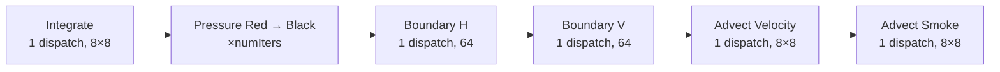
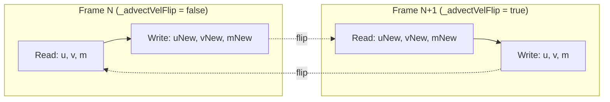

# GPU Compute & Rendering Pipeline

How the WebGPU compute shaders and 2D canvas renderer work together to simulate and visualize fluid flow. For the numerical algorithms behind each shader, see [Numerical Methods](numerical-methods.md). For how these pieces fit into the overall application, see [Architecture](architecture.md).

---

## 1. Buffer Layout

All field buffers share the same flat layout: `numX * numY` float32 values in column-major order (index = `i * numY + j`). Created in `FluidSolver._createBuffers()`.

### Field Buffers

| Buffer | Type | Size (bytes) | Usage Flags | Purpose |
|--------|------|-------------|-------------|---------|
| `u` | Float32 | numX × numY × 4 | STORAGE \| COPY_SRC \| COPY_DST | Horizontal velocity |
| `v` | Float32 | numX × numY × 4 | STORAGE \| COPY_SRC \| COPY_DST | Vertical velocity |
| `p` | Float32 | numX × numY × 4 | STORAGE \| COPY_SRC \| COPY_DST | Pressure |
| `s` | Float32 | numX × numY × 4 | STORAGE \| COPY_SRC \| COPY_DST | Solid mask (0 = solid, 1 = fluid) |
| `m` | Float32 | numX × numY × 4 | STORAGE \| COPY_SRC \| COPY_DST | Smoke/dye density |
| `uNew` | Float32 | numX × numY × 4 | STORAGE \| COPY_SRC \| COPY_DST | Ping-pong pair for u |
| `vNew` | Float32 | numX × numY × 4 | STORAGE \| COPY_SRC \| COPY_DST | Ping-pong pair for v |
| `mNew` | Float32 | numX × numY × 4 | STORAGE \| COPY_SRC \| COPY_DST | Ping-pong pair for m |

All 8 field buffers use the same usage flags (`STORAGE | COPY_SRC | COPY_DST`). `COPY_SRC` enables GPU-side readback to staging buffers. `COPY_DST` enables CPU-side writes via `device.queue.writeBuffer()`.

### Uniform Buffers

Three uniform buffers (`uniformBuf`, `uniformBufRed`, `uniformBufBlack`), each 32 bytes with usage `UNIFORM | COPY_DST`. The red/black variants differ only in the `color` field (0 or 1) for the pressure solver's red-black Gauss-Seidel checkerboard.

**Struct layout (32 bytes):**

| Offset | Field | Type | Description |
|--------|-------|------|-------------|
| 0 | `numX` | u32 | Grid width |
| 4 | `numY` | u32 | Grid height |
| 8 | `h` | f32 | Cell spacing |
| 12 | `dt` | f32 | Time step |
| 16 | `gravity` | f32 | Gravitational acceleration |
| 20 | `omega` | f32 | SOR relaxation factor |
| 24 | `density` | f32 | Fluid density |
| 28 | `color` | u32 | 0 = red, 1 = black (pressure solver only) |

---

## 2. Compute Pipeline Architecture

Each simulation frame dispatches all compute passes into a single `commandEncoder`, submitted with one `device.queue.submit()` call.

**Dispatch counts per frame:** 4 fixed dispatches (integrate, boundary H, boundary V, advect velocity, advect smoke = 5... but advect velocity + advect smoke are 2, boundary is 2, integrate is 1, so 5) plus 2 × `numIters` for pressure. At the default 40 iterations: **85 dispatches** in a single command buffer.

**Workgroup sizing:**

| Shader | Workgroup size | Dispatch dimensions |
|--------|---------------|---------------------|
| integrate | `@workgroup_size(8, 8)` | `ceil(numX/8) × ceil(numY/8) × 1` |
| pressure | `@workgroup_size(8, 8)` | `ceil(numX/8) × ceil(numY/8) × 1` |
| boundary H | `@workgroup_size(64)` | `ceil(numX/64) × 1 × 1` |
| boundary V | `@workgroup_size(64)` | `ceil(numY/64) × 1 × 1` |
| advect_velocity | `@workgroup_size(8, 8)` | `ceil(numX/8) × ceil(numY/8) × 1` |
| advect_smoke | `@workgroup_size(8, 8)` | `ceil(numX/8) × ceil(numY/8) × 1` |

---

## 3. Bind Group Strategy

The solver creates 4 explicit `GPUBindGroupLayout` objects and 8 bind groups. Explicit layouts are required because `layout: 'auto'` only includes bindings that are **statically used** by the shader entry point. For example, `boundary.wgsl`'s `extrapolate_horizontal` uses `u` but not `v` — an auto-layout would omit the `v` binding, and bind group creation would fail with a layout mismatch.

### Bind Group Layouts

| Layout | Bindings |
|--------|----------|
| `_integrateBGL` | uniform(0), storage(1), storage(2), read-only-storage(3) |
| `_pressureBGL` | uniform(0), storage(1), storage(2), read-only-storage(3), storage(4) |
| `_boundaryBGL` | uniform(0), storage(1), storage(2) |
| `_advectBGL` | uniform(0), read-only-storage(1,2,3), storage(4,5) |

### Bind Groups

| Bind Group | Layout | Binding 0 | Binding 1 | Binding 2 | Binding 3 | Binding 4 | Binding 5 |
|------------|--------|-----------|-----------|-----------|-----------|-----------|-----------|
| `integrateBindGroup` | integrate | uniformBuf | u | v | s | — | — |
| `pressureRedBindGroup` | pressure | uniformBufRed | u | v | s | p | — |
| `pressureBlackBindGroup` | pressure | uniformBufBlack | u | v | s | p | — |
| `boundaryBindGroup` | boundary | uniformBuf | u | v | — | — | — |
| `advectVelBindGroupA` | advect | uniformBuf | u | v | s | uNew | vNew |
| `advectVelBindGroupB` | advect | uniformBuf | uNew | vNew | s | u | v |
| `advectSmokeBindGroupA` | advect | uniformBuf | u | v | s | m | mNew |
| `advectSmokeBindGroupB` | advect | uniformBuf | u | v | s | mNew | m |

The boundary shader shares a single bind group across both `extrapolate_horizontal` and `extrapolate_vertical` entry points. The shared layout includes both `u` and `v` even though each entry point only uses one of them.

---

## 4. Ping-Pong Buffers

Advection cannot read and write the same buffer in one dispatch (a thread's output would corrupt another thread's input). The solver uses ping-pong buffer pairs to alternate read/write roles between frames.

After each `step()`, the solver toggles `_advectVelFlip` and `_advectSmokeFlip`, switching which bind group (A or B) is active for the next frame. The `smokeBuffer` and `velocityBuffers` getters use the flip state to return the correct (most recently written) buffer for readback.

**Critical rule:** when writing boundary conditions or inflow velocities from JavaScript (e.g., `writeBuffer` calls in preset setup), **write to both buffers** in each pair — the solver may read from either one depending on the current flip state.

See [Boundary Conditions](numerical-methods.md#boundary-conditions) for the numerical rationale.

---

## 5. Solid Mask Through the Pipeline

The `s` buffer (solid mask: 0.0 = solid, 1.0 = fluid) is rasterized on the CPU via `rasterizeObstacle()` in `interaction.js` and uploaded to the GPU with `device.queue.writeBuffer()`. It flows through all four compute stages differently:

**integrate.wgsl:** Skips cells where `s[idx] == 0` (the cell itself is solid) or `s[i*n + j-1] == 0` (the cell below is solid). Only applies gravity to velocity faces between two fluid cells.

**pressure.wgsl:** Counts fluid neighbors via `sx0 + sx1 + sy0 + sy1` (the s-values of the 4 cardinal neighbors). Skips cells where `s[idx] == 0` (solid cell) or where `sTotal == 0` (all neighbors are solid). The divergence correction is divided by `sTotal`, naturally handling partial fluid neighborhoods near boundaries.

**boundary.wgsl:** Does **not** read `s`. Operates only on domain edges (row 0/last row for horizontal, column 0/last column for vertical), extrapolating interior velocities to boundary cells regardless of solid state.

**advect.wgsl:** Only advects cells where `s[idx] != 0` (fluid). For velocity advection, additionally checks the solid state at the neighboring face (`s[(i-1)*n+j]` for u, `s[i*n+j-1]` for v) — if either cell sharing a velocity face is solid, that face's velocity is not advected. Smoke advection simply checks `s[idx] != 0`.

---

## 6. Rendering Pipeline

The renderer (`Renderer` class in `renderer.js`) uses a 2D canvas, not WebGPU render passes. The GPU is used only for compute; visualization is CPU-side via `putImageData`.

### Readback Flow

1. **Copy:** `encoder.copyBufferToBuffer()` from the solver's active smoke or pressure buffer to a persistent staging buffer (`MAP_READ | COPY_DST`).
2. **Map:** `_stagingBuffer.mapAsync(GPUMapMode.READ)` — asynchronous. While pending, the `readbackPending` flag prevents new readback requests, ensuring at most one outstanding map operation.
3. **Extract:** `new Float32Array(raw.slice(0))` copies the mapped data, then `unmap()` releases the staging buffer for reuse.

### Field Visualization

`_renderField()` converts the float32 field data to RGBA pixels:

- **Smoke mode:** Fixed range [0, 1]. Colormap: **magma** (256-entry LUT from `static/colormaps/magma.png`). `m = 0` (dye) maps to dark, `m = 1` (clear) maps to bright.
- **Pressure mode:** Auto-ranged, centered around the mean for symmetric diverging display. Colormap: **coolwarm** (from `static/colormaps/coolwarm.png`).
- **Solid cells:** Rendered as dark gray `rgb(50, 50, 60)` by checking the solid mask (`solidData[idx] === 0`).
- **Fallback:** If colormap PNGs haven't loaded yet, uses grayscale.

Colormaps are loaded at construction time from `static/colormaps/{viridis,coolwarm,magma}.png`. Each PNG is drawn to an offscreen 256x1 canvas and read back as a `Uint8Array` LUT.

### Device Loss

In `main.js`, `device.lost.then()` displays an error banner (`#device-lost-banner`) with a reload button. The simulation is not recoverable without reloading the page.

---

## 7. Overlay Rendering

All overlays are drawn on the same 2D canvas using the Canvas 2D API, on top of the field visualization.

### Velocity Readback

Separate from the field readback. Uses two temporary staging buffers (one for `u`, one for `v`), created and destroyed per readback. Throttled by `_velReadbackPending` flag and triggered every 10 frames (only when streamlines or velocity arrows are enabled).

### Streamlines

`_computeStreamlines()`:
- **Seeding:** Every 5th cell in both dimensions (starting at `i=1, j=1`)
- **Integration:** 25 segments per streamline, step scale 0.01
- **Velocity sampling:** Bilinear interpolation via `_sampleVel()` with staggered-grid offsets (dy = h/2 for u, dx = h/2 for v)
- **Termination:** Stops if velocity is zero or the particle leaves the domain
- **Caching:** Results stored in `_cachedStreamlines`, redrawn from cache every frame
- **Style:** White lines at 70% opacity, 1.5px width

### Velocity Arrows

`_computeArrows()`:
- **Sampling:** Every 8th cell in both dimensions
- **Sizing:** Arrow length proportional to velocity magnitude (max 12px), with a 1% threshold filter
- **Color coding:** RGB interpolated by speed fraction — low speed is dark blue-green `rgb(30, 80, 120)`, high speed is bright cyan-green `rgb(0, 255, 255)`
- **Arrowhead:** Triangular, length = 40% of shaft (min 3px), angle offset ±0.5 radians
- **Caching:** Results stored in `_cachedArrows`, redrawn from cache every frame

### Obstacle Overlay

Drawn via Canvas 2D primitives (`arc`, `fillRect`/`strokeRect`, `beginPath`/`lineTo`) based on `interaction.activeShape`. Supports four shapes: circle, square, airfoil (NACA 0012 profile), and wedge (15-degree half-angle). Fill color adapts to display mode: black on pressure view, light gray on smoke view.

---

## 8. Performance Characteristics

**Single outstanding readback.** The `readbackPending` flag ensures at most one `mapAsync` is in flight for the field buffer. A second readback is not issued until the first completes. This prevents staging buffer contention and GPU pipeline stalls.

**Batched compute submission.** All dispatches for one simulation step (integrate, pressure iterations, boundary, advection) are recorded into a single `GPUCommandEncoder` and submitted with one `device.queue.submit()` call. No synchronization barriers between passes — WebGPU guarantees sequential execution within a submission.

**Cached overlay geometry.** Streamline paths and velocity arrow geometry are computed once per velocity readback (every 10 frames) and stored in `_cachedStreamlines` / `_cachedArrows`. Every frame, the cached geometry is drawn with cheap Canvas 2D calls. This decouples overlay cost from the rendering frame rate.

**Lazy solid mask readback.** The solid mask (`s` buffer) is read back once after initialization. It is re-read only when `invalidateSolid()` is called — triggered by preset changes or obstacle drags. Since the solid mask changes infrequently compared to velocity/smoke fields, this avoids unnecessary GPU-CPU transfers.

**Velocity readback is destructive/temporary.** Unlike the field readback (which reuses a persistent staging buffer), velocity readback creates and destroys two staging buffers per readback cycle. This is acceptable because it happens at most every 10 frames and only when overlays are enabled.
