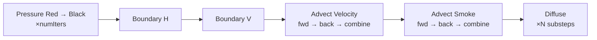

# GPU Compute & Rendering Pipeline

How the WebGPU compute shaders and the renderer work together to simulate and visualize fluid flow. For the numerical algorithms behind each shader, see [Numerical Methods](numerical-methods.md). For how these pieces fit into the overall application, see [Architecture](architecture.md).

---

## 1. Buffer Layout

All field buffers share the same flat layout: `numX * numY` float32 values in column-major order (index = `i * numY + j`). Created in `FluidSolver._createBuffers()`.

### Field Buffers

Velocity and smoke live in a **three-slot rotation** (§4), so there are 11 field buffers, not 8:

| Buffer | Count | Size (bytes) | Purpose |
|--------|-------|-------------|---------|
| `velPairs[0..2].u` | 3 | numX × numY × 4 | Horizontal velocity, one per rotation slot |
| `velPairs[0..2].v` | 3 | numX × numY × 4 | Vertical velocity, one per rotation slot |
| `smokeBufs[0..2]` | 3 | numX × numY × 4 | Smoke/dye density, one per rotation slot |
| `p` | 1 | numX × numY × 4 | Pressure |
| `s` | 1 | numX × numY × 4 | Solid mask (0 = solid, 1 = fluid) |

All use the same usage flags (`STORAGE | COPY_SRC | COPY_DST`). `COPY_SRC` enables GPU-side readback to staging buffers. `COPY_DST` enables CPU-side writes via `device.queue.writeBuffer()`.

Pressure is a single buffer because the red-black sweep updates it in place, alternating colours; the solid mask is written only from the CPU.

### Uniform Buffers

**Five** uniform buffers, each 32 bytes with usage `UNIFORM | COPY_DST | COPY_SRC` — `COPY_SRC` lets tests read back what was uploaded (the sign of `dt` in `uniformBufNegDt` is not observable any other way). They share one `Params` struct and differ only in which fields are overridden:

| Buffer | Overrides | Used by |
|--------|-----------|---------|
| `uniformBuf` | — | boundary, the forward advect passes, both MacCormack combines |
| `uniformBufRed` | `color = 0` | pressure, red sweep |
| `uniformBufBlack` | `color = 1` | pressure, black sweep |
| `uniformBufNegDt` | `dt = -dt` | the backward advect passes |
| `uniformBufVisc` | `dt = dt/N`, `nu = nuEff` | diffusion |

`uniformBufNegDt` is why the backward MacCormack trace needs no second shader — the sign flip is data, not code. `uniformBufVisc` is rewritten every step the viscous pass runs, because both `N` and the effective `nu` depend on the current `nu`, `h` and `dt`.

**Struct layout (32 bytes):**

| Offset | Field | Type | Description |
|--------|-------|------|-------------|
| 0 | `numX` | u32 | Grid width |
| 4 | `numY` | u32 | Grid height |
| 8 | `h` | f32 | Cell spacing |
| 12 | `dt` | f32 | Time step (negative on the backward pass, `dt/N` on the viscous pass) |
| 16 | `omega` | f32 | SOR relaxation factor |
| 20 | `density` | f32 | Fluid density |
| 24 | `color` | u32 | 0 = red, 1 = black (pressure solver only) |
| 28 | `nu` | f32 | Kinematic viscosity (diffusion only) |

A test asserts the `Params` struct is byte-identical across the four advection shaders plus `diffuse.wgsl` (the only `nu` reader), and the `Stencil` struct across the four advection shaders — a field reorder would otherwise re-trace with the wrong values and stay invisible to every behavioural test.

---

## 2. Compute Pipeline Architecture

Each simulation frame dispatches all compute passes into a single `commandEncoder`, submitted with one `device.queue.submit()` call.


```mermaid
graph LR
    B["Pressure Red → Black<br/>×numIters"] --> C[Boundary H]
    C --> D[Boundary V]
    D --> E["Advect Velocity<br/>fwd → back → combine"]
    E --> F["Advect Smoke<br/>fwd → back → combine"]
    F --> G["Diffuse<br/>×N substeps"]
```

**Seven compute shader files, eight pipelines:**

| Shader file | Entry point | Role |
|---|---|---|
| `pressure.wgsl` | `main` | Red-black SOR projection |
| `boundary.wgsl` | `extrapolate_horizontal`, `extrapolate_vertical` | Free-slip domain edges (two pipelines, one module) |
| `advect.wgsl` | `advect_velocity` | Semi-Lagrangian trace for velocity, both directions |
| `advect_smoke.wgsl` | `advect_smoke` | Semi-Lagrangian trace for smoke, both directions |
| `maccormack_velocity.wgsl` | `maccormack_velocity` | Limited combine for velocity |
| `maccormack.wgsl` | `maccormack_smoke` | Limited combine for smoke |
| `diffuse.wgsl` | `diffuse` | Explicit five-point viscous update |

Velocity and smoke need separate trace shaders because velocity has two components and the backward pass keeps phi^n on the advecting-velocity bindings rather than using a separate origin binding like smoke; the combine shaders also differ (velocity carries no solid mask).

**Dispatch counts per frame:** `2×numIters` (pressure) + 2 (boundary H, V) + 3 (velocity MacCormack) + 3 (smoke MacCormack) + `N` (viscous substeps, 0 when `nu = 0`, at most 32).

```
total = 2*numIters + 8 + N
```

At the Kármán preset's 256 iterations with 2 substeps: **522 dispatches** in a single command buffer. The pressure sweep dominates by two orders of magnitude, which is why the iteration count is the lever that moves both frame cost and the honest Reynolds ceiling.

**Workgroup sizing:**

| Shader | Workgroup size | Dispatch dimensions |
|--------|---------------|---------------------|
| pressure | `@workgroup_size(8, 8)` | `ceil(numX/8) × ceil(numY/8) × 1` |
| boundary H | `@workgroup_size(64)` | `ceil(numX/64) × 1 × 1` |
| boundary V | `@workgroup_size(64)` | `ceil(numY/64) × 1 × 1` |
| advect_velocity | `@workgroup_size(8, 8)` | `ceil(numX/8) × ceil(numY/8) × 1` |
| advect_smoke | `@workgroup_size(8, 8)` | `ceil(numX/8) × ceil(numY/8) × 1` |
| maccormack_velocity | `@workgroup_size(8, 8)` | `ceil(numX/8) × ceil(numY/8) × 1` |
| maccormack_smoke | `@workgroup_size(8, 8)` | `ceil(numX/8) × ceil(numY/8) × 1` |
| diffuse | `@workgroup_size(8, 8)` | `ceil(numX/8) × ceil(numY/8) × 1` |

---

## 3. Bind Group Strategy

The solver creates **7 explicit `GPUBindGroupLayout` objects**. Explicit layouts are required because `layout: 'auto'` only includes bindings that are **statically used** by the shader entry point. For example, `boundary.wgsl`'s `extrapolate_horizontal` uses `u` but not `v` — an auto-layout would omit the `v` binding, and bind group creation would fail with a layout mismatch. See [ADR-0002](adr/0002-explicit-bind-group-layouts.md).

### The storage-buffer budget

Every layout was designed against `maxStorageBuffersPerShaderStage`, whose guaranteed minimum is **8**. Uniforms do not count toward it. The two advection layouts are the tight ones:

| Layout | Bindings | Storage buffers |
|--------|----------|-----------------|
| `_pressureBGL` | uniform(0), storage(1,2), read-only(3), storage(4) | 4 |
| `_boundaryBGL` | uniform(0), storage(1,2) | 2 |
| `_advectVelBGL` | uniform(0), read-only(1–5), storage(6,7) | **7** |
| `_mcVelBGL` | uniform(0), read-only(1–4), storage(5,6) | 6 |
| `_advectSmokeBGL` | uniform(0), read-only(1–5), storage(6) | 6 |
| `_mcSmokeBGL` | uniform(0), read-only(1–4), storage(5), read-only(6) | 6 |
| `_diffuseBGL` | uniform(0), read-only(1–3), storage(4,5) | 5 |

`_advectVelBGL` reaches 7 because the backward pass needs the advecting velocity (`u^n, v^n`), the solid mask, the field being advected (`phi^`), *and* the origin field (`phi^n`) all bound at once — the origin field is what makes a reverted face write `phi^n` rather than `phi^`. On the forward pass the same buffers alias onto both read-only pairs, which is legal.

`_mcVelBGL` carries no solid mask, unlike the smoke combine. It does not need one: the velocity limiter's `phi^` seed makes the clamp the identity wherever a face reverted, so a solid guard would be a provable no-op.

### Bind groups, indexed by rotation slot

| Table | Shape | Indexed by |
|---|---|---|
| `pressureRed`, `pressureBlack`, `boundary` | 3 | velocity slot (they write velocity in place) |
| `velFwd`, `velBack`, `velCombine` | 3 | velocity slot alone — velocity is both the advecting and advected field |
| `smokeFwd`, `smokeBack`, `smokeCombine` | 3 × 3 | `[velCur][smokeCur]` — the velocity carrying the dye is not tied to the smoke rotation |
| `diffuse` | 3 × 3 | `[src][dst]`; the diagonal is `null` (a pass cannot read and write the same buffer) |

The smoke tables must be two-dimensional. Keying the advecting velocity off the smoke index instead would trace dye through the wrong velocity field — a bug that existed before the rotation landed and is now pinned by a test that reads back the actually-bound buffers.

---

## 4. The Three-Slot Rotation

Advection cannot read and write the same buffer in one dispatch (a thread's output would corrupt another thread's input). MacCormack needs **three** fields live simultaneously — `phi^n`, `phi^` (the forward result), and `phi~` (the backward result) — so a two-buffer ping-pong is not enough. Velocity and smoke each rotate through three slots.

For a live slot `c`:

```
phi^n   = slot c
phi^    = slot (c + 1) % 3      (hat,   written by the forward pass)
phi~    = slot (c + 2) % 3      (tilde, written by the backward pass)
```

The combine writes `phi^{n+1}` **in place into tilde**, so the inviscid step advances the index by +2 and the sequence runs `0, 2, 1, 0, 2, 1, …`.

**The viscous pass breaks that regularity.** It ping-pongs between the combine's output pair and the one pair the step has finished with, so after `N` substeps the result lands on tilde when `N` is even and on hat when `N` is odd. `step()` therefore publishes the final source slot rather than adding a fixed offset — which is the first thing in the codebase that makes `_velCur` and `_smokeCur` diverge, and the reason the smoke bind groups need the `[velCur][smokeCur]` table above.

The `smokeBuffer` and `velocityBuffers` getters return the currently published slot for readback.

**Critical rule:** when writing boundary conditions, inflow velocities, or obstacle velocities from JavaScript (e.g. `writeBuffer` calls in preset setup or `rasterizeObstacle`), **write to all three slots**. `writeU`, `writeV`, `writeSmoke` and `writeSmokeCell` do this; reaching for a raw buffer does not.

See [Boundary Conditions](numerical-methods.md#7-boundary-conditions) for the numerical rationale.

---

## 5. Solid Mask Through the Pipeline

The `s` buffer (solid mask: 0.0 = solid, 1.0 = fluid) is rasterized on the CPU via `rasterizeObstacle()` in `interaction.js` and uploaded to the GPU with `device.queue.writeBuffer()`. Each compute stage reads it differently:

**pressure.wgsl:** Counts fluid neighbors via `sx0 + sx1 + sy0 + sy1` (the s-values of the 4 cardinal neighbors). Skips cells where `s[idx] == 0` (solid cell) or where `sTotal == 0` (all neighbors are solid). The divergence correction is divided by `sTotal`, naturally handling partial fluid neighborhoods near boundaries.

**boundary.wgsl:** Does **not** read `s`. Operates only on domain edges (row 0/last row for horizontal, column 0/last column for vertical), extrapolating interior velocities to boundary cells regardless of solid state.

**advect.wgsl / advect_smoke.wgsl:** Only advects cells where `s[idx] != 0` (fluid). For velocity advection, additionally checks the solid state at the neighboring face (`s[(i-1)*n+j]` for u, `s[i*n+j-1]` for v) — if either cell sharing a velocity face is solid, that face's velocity is not advected. Smoke advection simply checks `s[idx] != 0`. The revert condition depends only on `s` and the indices, so it fires identically on the forward and backward passes.

**maccormack.wgsl:** Skips solid cells, and drops solid corners from the limiter's bounds **unconditionally** while widening them (line ~153, `if (s[k] == 0.0) { continue; }` — no `dt` gate; the combine only ever runs on the forward re-trace, so `dt` is always positive here). Dropping the solid corners cannot wall the dye out, because the bounds are seeded with `phi^` itself (the first-order forward result), which already carries each solid corner at its bilinear weight — so the widening is fluid-only and the inlet band injected through the solid left wall survives. The `dt < 0.0` gate — which reverts near-solid cells on the **backward pass only** — lives in `advect_smoke.wgsl:133`, not here.

**maccormack_velocity.wgsl:** Binds no solid mask at all. The `phi^` seed makes the clamp the identity wherever a face reverted, so a guard would be a provable no-op.

**diffuse.wgsl:** Classifies each velocity *face* three ways — FLUID (both flanking cells fluid, diffused), WALL (exactly one solid, copied through, preserving the no-penetration BC and the inflow column), BURIED (both solid, **or** `i == 0` / `j == 0`, read as a ghost `-center`). The index-based part of the BURIED test is load-bearing: at `j = 0` for `u` and `i = 0` for `v` both flanking cells are fluid, so the FLUID predicate does not block the read, and the mask test itself would underflow. The domain ring (first and last rows and columns) is copied through unchanged, which is why those boundary lines carry no viscous update.

---

## 6. Rendering Pipeline

Rendering is split across two stacked, display-resolution canvases (see [ADR-0005](adr/0005-hybrid-gpu-field-rendering.md)):

| Layer | Canvas | Context | Drawn by | Content |
|-------|--------|---------|----------|---------|
| Bottom (z-index 0) | `#field-canvas` | `webgpu` | `FieldRenderer` (`field-renderer.js`) | Colormapped scalar field — smoke or pressure |
| Top (z-index 1) | `#overlay-canvas` | `2d` | `Renderer` (`renderer.js`) | Streamlines, velocity arrows, particles, obstacle |

Both canvases are created in JS (`field-renderer.js`, `renderer.js`) and sized to `container.clientWidth/Height × devicePixelRatio`, clamped so the larger dimension stays within `MAX_BACKING_DIM` (3840) — display pixels, independent of grid resolution. Neither is resized when the grid changes tier.

### Field Render Pass

`FieldRenderer.draw(fieldBuffer, colormapName, minVal, maxVal)` runs every frame. It writes a 16-byte uniform (`numX`, `numY`, `minVal`, `maxVal`), then records one render pass drawing a 3-vertex fullscreen triangle (`pass.draw(3)`) into the canvas texture.

`render_field.wgsl`:

- **Field sampling:** The field is a `storage, read` buffer, not a texture — `fs_main` does manual bilinear interpolation in cell-center space (cell `(i,j)` centered at `(i+0.5, j+0.5)`). `fluidValue()` substitutes the nearest cell's value for solid neighbors so filtering doesn't bleed stale in-solid values across obstacle edges.
- **Solid cells:** Tested per-fragment against the `solid` storage buffer at the *nearest* cell (keeps edges crisp) and returned as dark gray `vec4(50, 50, 60)/255` before any sampling. No solid readback is involved.
- **Colormap:** The normalized value `t = (value - minVal) / (maxVal - minVal)` indexes a 256x1 LUT **texture** via `textureSampleLevel`. `textureSampleLevel` (not `textureSample`) is required — the solid early-return makes the control flow non-uniform.

Pipeline layout is explicit, never `layout: 'auto'` (see [ADR-0002](adr/0002-explicit-bind-group-layouts.md)): group 0 = uniform + field buffer + solid buffer, group 1 = LUT texture + sampler.

### Colormap LUTs

`_loadLuts(['magma', 'coolwarm'])` runs once in the async `FieldRenderer.create()` factory. Each `static/colormaps/<name>.png` is fetched as a blob, decoded with `createImageBitmap()`, and uploaded to a 256x1 `rgba8unorm` texture via `device.queue.copyExternalImageToTexture()`. One bind group is cached per colormap name. Until the textures resolve, `draw()` returns early and skips the frame — there is no grayscale fallback.

**Display ranges:**

- **Smoke mode:** `magma`, fixed range `[0, 1]`. `m = 0` (dye) maps to dark, `m = 1` (clear) to bright. No readback needed.
- **Pressure mode:** `coolwarm`, auto-ranged symmetrically about the field mean so zero gauge pressure sits at the colormap center. Requires the throttled pressure readback below.

### Readback Flow

Three independent readbacks feed the CPU side. None of them is needed to draw the field itself.

**1. Pressure (throttled, temporary staging buffer).** Only issued when the pressure view is active and only on `_frameCount % 10 === 1`. A fresh staging buffer (`MAP_READ | COPY_DST`) is created per cycle; `copyBufferToBuffer()` from `solver.pressureBuffer` into it, then `mapAsync`; the resolved data goes to `_computePressureRange()`, which returns `[mean - range, mean + range]` for the next frames' `minVal`/`maxVal`. The buffer is destroyed on both the success and error paths, so — like the velocity and solid readbacks below — a resize cannot free it mid-map. The `readbackPending` flag keeps at most one map in flight. Smoke needs no equivalent — its range is fixed.

**2. Velocity (throttled, temporary staging buffers).** Every 10 frames, gated on `showStreamlines || showVelocities || showParticles || showProbe`. Two staging buffers are created and destroyed per cycle for `u` and `v`. On completion `_velDataGen` increments, which is what triggers streamline and arrow geometry to be recomputed.

**3. Solid mask (lazy, one-shot staging buffer).** Read once after init and again whenever `invalidateSolid()` marks it stale (preset change, obstacle drag, resize). The Field View no longer needs this — it reads the solid buffer directly on the GPU — but the particle system still needs `solidData` on the CPU to kill particles that enter solids.

### Device Loss

In `main.js`, `device.lost.then()` displays an error banner (`#device-lost-banner`) with a reload button. The simulation is not recoverable without reloading the page.

---

## 7. Overlay Rendering

All overlays are drawn with the Canvas 2D API on the transparent `#overlay-canvas`, which sits above the WebGPU field canvas. `Renderer.draw()` clears it to transparent each frame before redrawing. Stroke widths are multiplied by `_overlayScale` (`canvas.height / numY`) so overlays keep their visual weight at display resolution.

### Velocity Readback

Separate from the field readback. Uses two temporary staging buffers (one for `u`, one for `v`), created and destroyed per readback. Throttled by `_velReadbackPending` flag and triggered every 10 frames. The readback gate condition fires when streamlines, velocity arrows, the particle system, **or the probe** are active — particles and the probe need velocity data even when the other overlays are off.

### Streamlines

`_computeStreamlines()`:
- **Seeding:** Every 5th cell in both dimensions (starting at `i=1, j=1`)
- **Integration:** 25 segments per streamline, step scale 0.01
- **Velocity sampling:** Bilinear interpolation via `_sampleVel()` with staggered-grid offsets (dy = h/2 for u, dx = h/2 for v)
- **Termination:** Stops if velocity is zero or the particle leaves the domain
- **Caching:** Results stored in `_cachedStreamlines`, redrawn from cache every frame
- **Style:** White lines at 70% opacity, 1.5px width

### Velocity Arrows

`_computeArrows()`:
- **Sampling:** Every 8th cell in both dimensions
- **Sizing:** Arrow length proportional to velocity magnitude (max 12px), with a 1% threshold filter
- **Color coding:** RGB interpolated by speed fraction — low speed is dark blue-green `rgb(30, 80, 120)`, high speed is bright cyan-green `rgb(0, 255, 255)`
- **Arrowhead:** Triangular, length = 40% of shaft (min 3px), angle offset ±0.5 radians
- **Caching:** Results stored in `_cachedArrows`, redrawn from cache every frame

### Particle Trails

Rendered via Canvas 2D after velocity arrows but before the obstacle overlay. Particles are advected on the CPU using the same velocity readback data as streamlines and arrows (see [Architecture — Particle Tracer](architecture.md#7-particle-tracer)). Each particle's trail (last 20 positions) is drawn as a polyline with opacity fading by age.

### Obstacle Overlay

Drawn via Canvas 2D primitives (`arc`, `fillRect`/`strokeRect`, `beginPath`/`lineTo`) based on `interaction.activeShape`. Supports four shapes: circle, square, airfoil (NACA 0012 profile), and wedge (15-degree half-angle). Fill color adapts to display mode: black on pressure view, light gray on smoke view.

---

## 8. Performance Characteristics

**Single outstanding readback.** The `readbackPending` flag ensures at most one `mapAsync` is in flight for the field buffer. A second readback is not issued until the first completes. This prevents staging buffer contention and GPU pipeline stalls.

**Batched compute submission.** All dispatches for one simulation step (pressure iterations, boundary, both MacCormack chains, and every viscous substep) are recorded into a single `GPUCommandEncoder` and submitted with one `device.queue.submit()` call. No synchronization barriers between passes — WebGPU guarantees sequential execution within a submission.

**The pressure sweep is the cost.** Measured wall-clock rAF frame times at the Kármán preset, fresh page load per row (the in-app HUD reported 0.2–0.5 ms for every configuration below, because it bracketed CPU *encode* time around calls that return before the GPU has done the work; it now differences rAF timestamps instead):

| tier | numIters | mean ms | median ms | mean fps | GPU ms/step |
|------|----------|---------|-----------|----------|-------------|
| 256 | 80 | 8.33 | 8.30 | 120.0 | 4.73 |
| 256 | 128 | 8.33 | 8.30 | 120.0 | 7.33 |
| 256 | **256** | **14.42** | **16.60** | **69.3** | **14.34** |
| 512 | 80 | 19.90 | 16.70 | 50.2 | 19.81 |
| 512 | 256 | 58.83 | 58.30 | 17.0 | 58.76 |

The display is 120 Hz, so rAF deltas quantize to multiples of 8.33 ms; the GPU column removes that by submitting 120 steps back-to-back and awaiting `onSubmittedWorkDone` once. The shipped configuration spends ~86% of a 60 fps budget on the dev machine.

**Timestep does not change frame cost.** The main loop runs exactly one `solver.step()` per rAF frame regardless of `dt`, so halving `dt` left frame time unchanged (8.33 → 8.34 ms mean) and the viscous substep count actually *fell*. What it costs is simulated time: one wall second now buys 0.5 sim seconds, so the vortex street takes about twice as long to appear.

**Cached overlay geometry.** Streamline paths and velocity arrow geometry are computed once per velocity readback (every 10 frames) and stored in `_cachedStreamlines` / `_cachedArrows`. Every frame, the cached geometry is drawn with cheap Canvas 2D calls. This decouples overlay cost from the rendering frame rate.

**Lazy solid mask readback.** The solid mask (`s` buffer) is read back once after initialization. It is re-read only when `invalidateSolid()` is called — triggered by preset changes or obstacle drags. Since the solid mask changes infrequently compared to velocity/smoke fields, this avoids unnecessary GPU-CPU transfers.

**Velocity readback is destructive/temporary.** It creates and destroys two staging buffers per readback cycle. This is acceptable because it happens at most every 10 frames and only when overlays are enabled.
